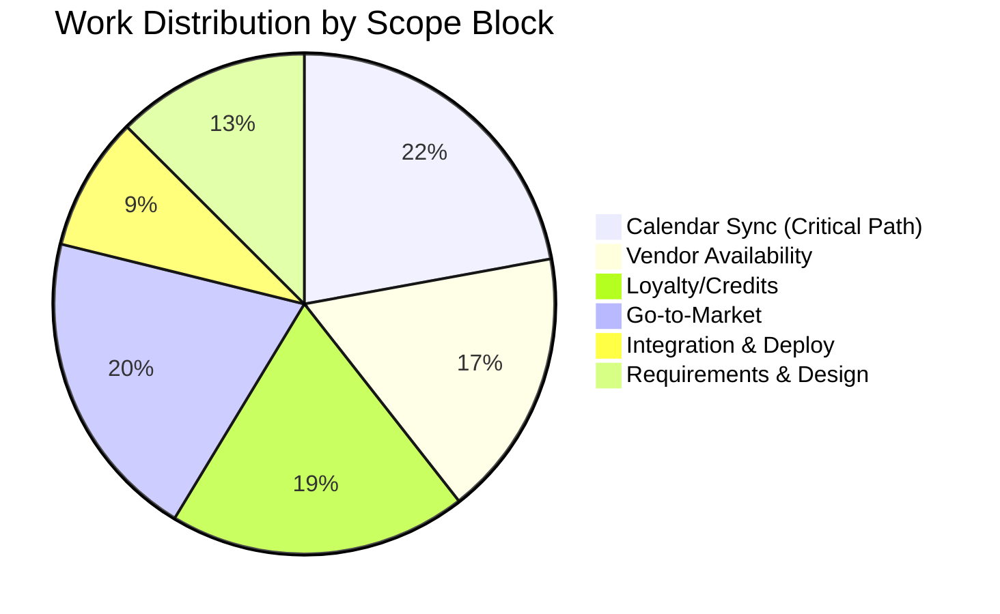
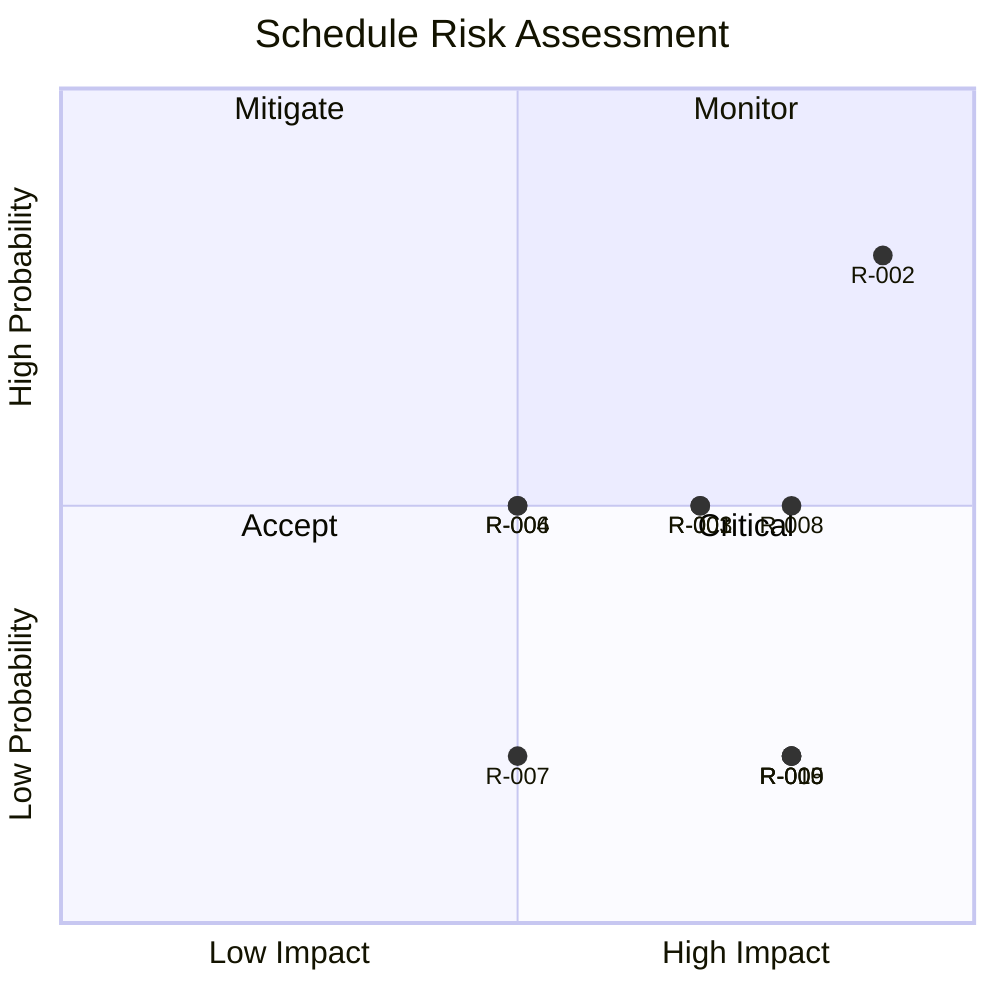

# Bookiji — Vendor Scheduling MVP: Visual Timeline

**Project Timeline:** 2026-01-05 to 2026-03-28 (58 business days)  
**Last Synced:** 2026-01-05

> 💡 **To update this timeline:** Run `node scripts/sync-jira-to-visual.mjs` to sync status from Jira, or manually update as work progresses.

---

## Indented Timeline (Tasks by Start Date)

Tasks are indented based on their start date - earlier tasks are less indented, later tasks are more indented.

```
2026-01-05 │ F-001: Requirements: Vendor availability hardening (2d → 2026-01-06)
           │ F-002: Requirements: Calendar sync 2-way (2d → 2026-01-06)
           │ F-003: Requirements: Loyalty/credits reconciliation (2d → 2026-01-06)

2026-01-07 │   F-004: Design: Availability conflict resolution (3d → 2026-01-09)
           │   F-005: Design: Calendar sync architecture (6d → 2026-01-12)

2026-01-10 │     F-006: Design: Credits reconciliation system (3d → 2026-01-12)

2026-01-12 │ M-REQ: REQ Baseline Approved ✅

2026-01-13 │   F-007: Test plan: Vendor availability hardening (2d → 2026-01-14)
           │   F-008: Test plan: Calendar sync + loyalty (2d → 2026-01-14)
           │   F-030: GTM: Pricing page updates (2d → 2026-01-14)

2026-01-15 │     F-031: GTM: Vendor onboarding flow enhancement (6d → 2026-01-20)

2026-01-19 │ M-DES: Design Baseline Approved ✅

2026-01-20 │   F-009: Vendor availability: Slot conflict detection (3d → 2026-01-22)
           │   F-015: Calendar sync: 2-way free/busy sync (7d → 2026-01-26) [CRITICAL PATH]
           │   F-023: Loyalty: Earn credits on booking completion (3d → 2026-01-22)
           │   F-034: GTM: Monitoring dashboard (4d → 2026-01-23)

2026-01-21 │     F-033: GTM: Email templates (onboarding sequence) (3d → 2026-01-23)

2026-01-23 │   F-010: Vendor availability: Atomic slot updates (4d → 2026-01-26)
           │   F-024: Loyalty: Redeem credits at checkout (4d → 2026-01-26)

2026-01-24 │     F-035: GTM: Error alerting (Sentry integration) (2d → 2026-01-25)

2026-01-26 │ M-TEST: Test Plan Approved ✅
           │   F-036: GTM: Performance monitoring (2d → 2026-01-27)

2026-01-27 │   F-011: Vendor availability: Recurring slot management (8d → 2026-02-03)
           │   F-016: Calendar sync: Write bookings to Google Calendar (8d → 2026-02-03)
           │   F-025: Loyalty: Tier progression logic (8d → 2026-02-03)

2026-01-28 │     F-037: GTM: Documentation (vendor guide) (7d → 2026-02-03)

2026-02-04 │   F-012: Vendor availability: Block time API (3d → 2026-02-06)
           │   F-017: Calendar sync: ICS export endpoint (3d → 2026-02-06)
           │   F-026: Loyalty: Credits reconciliation job (7d → 2026-02-10)

2026-02-07 │   F-013: Vendor availability: Conflict resolution UI (6d → 2026-02-12)
           │   F-018: Calendar sync: ICS import (vendor upload) (6d → 2026-02-12)

2026-02-11 │     F-027: Loyalty: Reconciliation dashboard (3d → 2026-02-13)

2026-02-13 │   F-014: Vendor availability: API hardening tests (5d → 2026-02-17)
           │   F-019: Calendar sync: Invite generation (email) (5d → 2026-02-17)

2026-02-14 │     F-028: Loyalty: Unit tests (earn/redeem/tier) (5d → 2026-02-18)

2026-02-18 │   F-020: Calendar sync: Update/cancel event sync (4d → 2026-02-21) [CRITICAL PATH]
           │   F-032: GTM: Email templates (booking confirmations) (3d → 2026-02-20)

2026-02-19 │     F-029: Loyalty: Reconciliation tests (3d → 2026-02-21)

2026-02-24 │   F-021: Calendar sync: Sync status dashboard (3d → 2026-02-26)

2026-02-27 │   F-022: Calendar sync: Integration tests (6d → 2026-03-04) [CRITICAL PATH]

2026-03-05 │   F-038: Integration: End-to-end booking flow test (6d → 2026-03-10)

2026-03-11 │     F-039: Integration: Load testing (3d → 2026-03-13)

2026-03-14 │ M-CODE: Code Freeze ✅

2026-03-21 │ M-RC: Release Candidate ✅

2026-03-24 │   F-040: Deploy: Staging deployment (2d → 2026-03-25)

2026-03-26 │     F-041: Deploy: Production deployment (2d → 2026-03-27)

2026-03-28 │ M-PROD: Production Approval ✅
           │   F-042: Closeout: Project retrospective (1d → 2026-03-28)

2026-03-29 │     F-043: Closeout: Handoff documentation (3d → 2026-04-01)
```

**Legend:**
- `│` = Timeline axis
- Indentation = Start date (more indented = later start)
- `[CRITICAL PATH]` = Tasks on the longest path
- `✅` = Milestones

---

## Gantt Chart (Mermaid)

```mermaid
gantt
    title Vendor Scheduling MVP Timeline
    dateFormat YYYY-MM-DD
    axisFormat %m/%d
    
    section Requirements
    F-001: Vendor availability hardening     :2026-01-05, 2d
    F-002: Calendar sync 2-way requirements  :2026-01-05, 2d
    F-003: Loyalty/credits reconciliation    :2026-01-05, 2d
    M-REQ: REQ Baseline Approved             :milestone, m1, 2026-01-12, 0d
    
    section Design
    F-004: Availability conflict resolution  :2026-01-07, 3d
    F-005: Calendar sync architecture        :2026-01-07, 6d
    F-006: Credits reconciliation system     :2026-01-10, 3d
    M-DES: Design Baseline Approved          :milestone, m2, 2026-01-19, 0d
    
    section Test Planning
    F-007: Test plan: Availability           :2026-01-13, 2d
    F-008: Test plan: Calendar + Loyalty    :2026-01-13, 2d
    M-TEST: Test Plan Approved               :milestone, m3, 2026-01-26, 0d
    
    section Vendor Availability (Build)
    F-009: Slot conflict detection           :crit, 2026-01-20, 3d
    F-010: Atomic slot updates               :crit, 2026-01-23, 4d
    F-011: Recurring slot management         :crit, 2026-01-27, 8d
    F-012: Block time API                    :2026-02-04, 3d
    F-013: Conflict resolution UI            :2026-02-07, 6d
    F-014: API hardening tests               :2026-02-13, 5d
    
    section Calendar Sync (Build) - CRITICAL PATH
    F-015: 2-way free/busy sync             :crit, 2026-01-20, 7d
    F-016: Write to Google Calendar          :crit, 2026-01-27, 8d
    F-017: ICS export endpoint               :2026-02-04, 3d
    F-018: ICS import (vendor upload)        :2026-02-07, 6d
    F-019: Invite generation (email)         :2026-02-13, 5d
    F-020: Update/cancel event sync          :crit, 2026-02-18, 4d
    F-021: Sync status dashboard             :2026-02-24, 3d
    F-022: Integration tests                 :crit, 2026-02-27, 6d
    
    section Loyalty/Credits (Build)
    F-023: Earn credits on completion       :2026-01-20, 3d
    F-024: Redeem credits at checkout        :2026-01-23, 4d
    F-025: Tier progression logic            :2026-01-27, 8d
    F-026: Credits reconciliation job        :2026-02-04, 7d
    F-027: Reconciliation dashboard          :2026-02-11, 3d
    F-028: Unit tests (earn/redeem/tier)     :2026-02-14, 5d
    F-029: Reconciliation tests              :2026-02-19, 3d
    
    section Go-to-Market (Build)
    F-030: Pricing page updates              :2026-01-13, 2d
    F-031: Vendor onboarding enhancement      :2026-01-15, 6d
    F-032: Email: Booking confirmations       :2026-02-18, 3d
    F-033: Email: Onboarding sequence         :2026-01-21, 3d
    F-034: Monitoring dashboard               :2026-01-20, 4d
    F-035: Error alerting (Sentry)           :2026-01-24, 2d
    F-036: Performance monitoring             :2026-01-26, 2d
    F-037: Documentation (vendor guide)       :2026-01-28, 7d
    
    section Integration & Testing
    F-038: End-to-end booking flow test       :crit, 2026-03-05, 6d
    F-039: Load testing                       :crit, 2026-03-11, 3d
    M-CODE: Code Freeze                       :milestone, m4, 2026-03-14, 0d
    M-RC: Release Candidate                   :milestone, m5, 2026-03-21, 0d
    
    section Deployment
    F-040: Staging deployment                 :crit, 2026-03-24, 2d
    F-041: Production deployment               :crit, 2026-03-26, 2d
    M-PROD: Production Approval                :milestone, m6, 2026-03-28, 0d
    
    section Closeout
    F-042: Project retrospective              :2026-03-28, 1d
    F-043: Handoff documentation              :2026-03-29, 3d
```

---

## Critical Path Visualization

```mermaid
graph LR
    A[F-001: Requirements<br/>Vendor Availability] --> B[F-004: Design<br/>Conflict Resolution]
    B --> C[F-009: Build<br/>Conflict Detection]
    C --> D[F-010: Build<br/>Atomic Updates]
    D --> E[F-011: Build<br/>Recurring Slots]
    E --> F[F-014: Test<br/>API Hardening]
    
    G[F-002: Requirements<br/>Calendar Sync] --> H[F-005: Design<br/>Sync Architecture]
    H --> I[F-015: Build<br/>2-way Sync]
    I --> J[F-016: Build<br/>Write to Calendar]
    J --> K[F-020: Build<br/>Update/Cancel]
    K --> L[F-022: Test<br/>Integration]
    
    M[F-003: Requirements<br/>Loyalty] --> N[F-006: Design<br/>Reconciliation]
    N --> O[F-023: Build<br/>Earn Credits]
    O --> P[F-024: Build<br/>Redeem Credits]
    P --> Q[F-026: Build<br/>Reconciliation Job]
    Q --> R[F-029: Test<br/>Reconciliation]
    
    F --> S[F-038: Integration Test]
    L --> S
    R --> S
    S --> T[F-039: Load Test]
    T --> U[M-RC: Release Candidate]
    U --> V[F-040: Staging]
    V --> W[F-041: Production]
    W --> X[M-PROD: Production Approval]
    
    style I fill:#ff6b6b
    style J fill:#ff6b6b
    style K fill:#ff6b6b
    style L fill:#ff6b6b
    style S fill:#4ecdc4
    style T fill:#4ecdc4
    style V fill:#95e1d3
    style W fill:#95e1d3
```



**Legend:**
- 🔴 Red: Critical path (Calendar Sync - longest path)
- 🔵 Blue: Integration & Testing
- 🟢 Green: Deployment

---

## Phase Timeline (Simplified)

```
┌─────────────────────────────────────────────────────────────────────────┐
│ JANUARY 2026                                                             │
├─────────────────────────────────────────────────────────────────────────┤
│ Week 1 (Jan 5-9)    │ Week 2 (Jan 12-16)  │ Week 3 (Jan 19-23)         │
│                     │                      │                            │
│ F-001, F-002, F-003 │ M-REQ ✅             │ M-DES ✅                    │
│ (Requirements)      │ F-004, F-005, F-006 │ F-009, F-010, F-015,       │
│                     │ (Design)             │ F-016, F-023, F-024        │
│                     │ F-007, F-008         │ (Build starts)             │
│                     │ (Test Planning)      │                            │
├─────────────────────────────────────────────────────────────────────────┤
│ FEBRUARY 2026                                                            │
├─────────────────────────────────────────────────────────────────────────┤
│ Week 1 (Feb 3-6)    │ Week 2 (Feb 10-13)   │ Week 3 (Feb 17-20)         │
│                     │                      │                            │
│ F-011, F-012        │ F-026, F-027         │ F-020, F-032               │
│ F-017, F-018        │ F-014                │ (Calendar sync complete)   │
│ F-025               │                      │                            │
│                     │                      │                            │
│ Week 4 (Feb 24-27)                                                      │
│ F-021, F-022        │                      │                            │
│ F-028, F-029        │                      │                            │
├─────────────────────────────────────────────────────────────────────────┤
│ MARCH 2026                                                               │
├─────────────────────────────────────────────────────────────────────────┤
│ Week 1 (Mar 3-6)    │ Week 2 (Mar 10-13)   │ Week 3 (Mar 17-20)         │
│                     │                      │                            │
│ F-038 (Integration) │ F-039 (Load Test)    │ M-RC ✅                    │
│                     │ M-CODE ✅            │                            │
│                     │                      │                            │
│ Week 4 (Mar 24-27)                                                      │
│ F-040 (Staging)     │                      │                            │
│ F-041 (Production)  │                      │                            │
│ M-PROD ✅           │                      │                            │
└─────────────────────────────────────────────────────────────────────────┘
```

---

## Scope Blocks Overview



---

## Milestone Timeline

```
2026-01-12  ┃ M-REQ: Requirements Baseline Approved
             ┃
2026-01-19  ┃ M-DES: Design Baseline Approved
             ┃
2026-01-26  ┃ M-TEST: Test Plan Approved
             ┃
             ┃ [Build Phase - Parallel Work]
             ┃ ┌─────────────────────────────┐
             ┃ │ Vendor Availability         │
             ┃ │ Calendar Sync (CRITICAL)     │
             ┃ │ Loyalty/Credits             │
             ┃ │ Go-to-Market                │
             ┃ └─────────────────────────────┘
             ┃
2026-03-14  ┃ M-CODE: Code Freeze
             ┃
2026-03-21  ┃ M-RC: Release Candidate
             ┃
2026-03-28  ┃ M-PROD: Production Approval ✅
```

---

## Risk Heat Map



**Top Risks:**
- 🔴 **R-002**: Calendar sync conflicts (High Impact, High Probability)
- 🟠 **R-001, R-003, R-008**: API limits, data inconsistencies, performance (High Impact, Medium Probability)

---

## Parallel Work Opportunities

```
After M-DES (2026-01-19):
┌─────────────────────────────────────────────────────────────┐
│ Stream 1: Vendor Availability                               │
│ F-009 → F-010 → F-011 → F-012, F-013 → F-014               │
├─────────────────────────────────────────────────────────────┤
│ Stream 2: Calendar Sync (CRITICAL PATH)                    │
│ F-015 → F-016 → F-017, F-018, F-019, F-020 → F-021, F-022 │
├─────────────────────────────────────────────────────────────┤
│ Stream 3: Loyalty/Credits                                   │
│ F-023 → F-024, F-025 → F-026 → F-027 → F-028, F-029       │
├─────────────────────────────────────────────────────────────┤
│ Stream 4: Go-to-Market                                      │
│ F-030 → F-031 → F-033, F-037                               │
│ F-034 → F-035, F-036                                        │
│ F-032 (depends on F-019)                                    │
└─────────────────────────────────────────────────────────────┘

All streams converge at F-038 (Integration Test) on 2026-03-05
```

---

## Deliverable Summary

**By Phase:**

- **Requirements (3 docs):** Vendor availability, Calendar sync, Loyalty reconciliation
- **Design (3 docs):** Conflict resolution, Sync architecture, Reconciliation system
- **Build (35 tasks):** Code, APIs, UI components, migrations
- **Verify (7 tests):** Unit, API, Integration, Load tests
- **Deploy (2 tasks):** Staging, Production
- **Closeout (2 docs):** Retrospective, Handoff

**Total:** 67 issues (18 past + 6 milestones + 43 future)

---

**View in Jira:** https://bookiiji.atlassian.net/browse/KAN  
**Full WBS:** `docs/VENDOR_SCHEDULING_MVP_WBS_GANTT.md`
